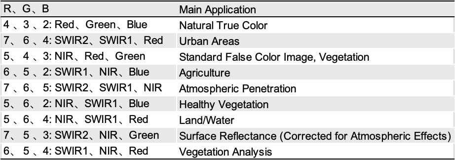

class: inverse, middle
 
# Outline:
## A. Overview of Landsat 8
## B. Summary of the Lnadsat 8 OLI Sensor
## C. Application of Landsat 8 OLI Data
## D. Reflections on the Landsat 8 OLI Sensor
---

## A. Overview of Landsat 8
<style>
  .remark-slide-content {
    font-size: 22px;
  }

</style> 
* Affiliation: NASA and the United States Geological Survey (USGS)
 
* The eighth satellite in the Landsat program

* Launching time: February 11, 2013

* Composition: the Operational Land Imager (OLI) and the Thermal Infrared Sensor (TIRS).They provide seasonal coverage of the global landmass at a spatial resolution of:
  * Visible, NIR, SWI: 30 meters
  * Thermal: 100 meters
  * Panchromatic: 15 meters
  
.small[Source: [NASA](https://en.wikipedia.org/wiki/Landsat_8)
]
---
class: inverse, middle

## B. Summary of the Lnadsat 8 OLI Sensor
### <br/>1. Overview
### <br/>2. Spectral bands of Landsat 8 OLI Sensor

---
```{r xaringan-logo, echo=FALSE}
library(xaringanExtra)
xaringanExtra::use_logo(
  image_url = "img/casa_logo.jpg",
  width = "50px",
  position = xaringanExtra::css_position(top = "1em", right = "2em")
)
```

### B1. Summary of the OLI Sensor - Overview
* Sensor type: Passive

* Key instrument on the Landsat 8 satellite

* Manufacturer: the Ball Aerospace & Technologies Corporation

* OLI utilizes a pushbroom sensor mechanism for greater imaging efficiency and quality

* Measurable bands: It captures images in 9 spectral bands, including visible, near-infrared (NIR), and shortwave infrared (SWIR) wavelengths, significantly improving upon the capabilities of previous Landsat sensors

* The sensor is designed for a wide array of Earth observation purposes

.small[Source: [Wikipedia](https://landsat.gsfc.nasa.gov/satellites/landsat-8/spacecraft-instruments/operational-land-imager/oli-requirements/), [USGS](https://www.usgs.gov/landsat-missions/landsat-8) and [NASA](https://landsat.gsfc.nasa.gov/satellites/landsat-8/spacecraft-instruments/operational-land-imager/oli-requirements/).
]
---

### B2. Spectral bands of Landsat 8 OLI Sensor
* Details of the Spectral bands for Landsat 8's OLI sensor are as follows：

```{r include=FALSE}
library(tidyverse) #where the mpg data is stored
# read CSV
OLI_spectral_bands <- read.csv("csv/OLI_spectral_bands.csv")

```

```{r echo=FALSE}
knitr::kable(OLI_spectral_bands, format = 'html')
```

.small[Source: [NASA](https://landsat.gsfc.nasa.gov/satellites/landsat-8/spacecraft-instruments/operational-land-imager/oli-requirements/) and [USGS](https://www.usgs.gov/landsat-missions/landsat-8)
]
---
## 3. Application of OLI Data
By calculating and analysing the different spectral bands of OLI, it is possible to make its application in many fields such as agriculture, ecological protection, water resource protection, etc.

```{r include=FALSE}
xaringanExtra::use_panelset()
```


.panelset[

.panel[.panel-name[OLI spectral band synthesis]

```{r include=FALSE}
library(knitr)
```

```{r echo=FALSE, out.width='91%', fig.align='center'}

```
]

.panel[.panel-name[Climate Change Studies]

* OLI data are used to monitor changes in glaciers and ice sheets, providing valuable information for climate change modelling and environmental policymaking.
]

.panel[.panel-name[Urban Expansion Analysis]

* OLI imagery data have played an important role in tracking urban sprawl and its impacts on natural habitats and water resources, contributing to better urban planning and management strategies.
]

.panel[.panel-name[Agricultural Monitoring]

* Researchers use OLI data to assess crop health and predict yields in agricultural areas. This helps with food security planning and sustainable agricultural practices.
]

]

.small[Source: [Landsat Science - Data Use](https://landsat.gsfc.nasa.gov/data/data-use/) (multiple tutorials or articles on the application of Landsat 8 OLI sensor data)
]
---
## 4. Reflections on the OLI Sensor

* During this week's self-study, I learnt about the background of Landsat 8's OLI sensor, its spectral bands, the application of its data and many other aspects.

* In the future, we can calculate the bands and analyse the data after processing, which could be applied in many fields such as agriculture, environmental protection, and so on.
 * For example, it is possible to extract the Antarctic ice cover through the calculation of the normalisation index and subsequent data processing, and to calculate and analyse the area of the ice cover in different years to analyse issues related to the Antarctic ecosystem.
---
class: inverse,middle
# This is the end of my  Presentation!
# <br/>Thank you!
# <br/>Any questions?


